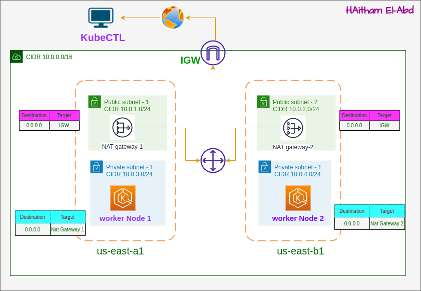

# Deploying Node.js App on Amazon EKS with Terraform



This guide will walk you through deploying a Node.js application on Amazon EKS using Terraform. 

## Infrastructure Overview

This project sets up the necessary AWS infrastructure for deploying the Node.js application on Amazon EKS using Terraform. The infrastructure includes:

- VPC Setup:
  - Created a Virtual Private Cloud (VPC) with the following components:
    - 2 Private Subnets: These subnets contain the worker nodes created using `eks_node_group` for the EKS cluster.
    - 2 Public Subnets: These subnets contain NAT Gateways for outbound internet traffic.
  - IAM Roles for Cluster: Configured IAM roles required for the EKS cluster.

## Prerequisites

Before getting started, make sure you have the following installed:

* Terraform (version >= X.X.X)
* AWS CLI (configured with appropriate permissions)
* kubectl

 Also, ensure you have an AWS account and have configured your AWS credentials.

## Steps for Deployment

### 1. Clone the Repository

Clone the repository containing your Node.js application:

```bash 
git clone https://github.com/h3itham/Terraform-AWS-EKS.git
```

```bash 
cd Terraform-AWS_EKS
```


### 2. Set Up Terraform

 Inside the repository folder, initialize Terraform and update the modules:

````bash 
cd terraform 
terraform init 
````

### 3. Deploy EKS Cluster

  Run Terraform to create the EKS cluster:

````bash 
terraform apply 
````


### 4. Configure kubectl

  Retrieve the cluster credentials to configure kubectl:

  ````bash 
  aws eks --region update-kubeconfig --name
  ````


### 5. Deploy Node.js Application

Deploy your Node.js application to the EKS cluster:

````bash 
kubectl apply -f Deployment.yml
kubectl apply -f Service.yml 
````


### 6. Access the Application

 Once deployed, you can access your Node.js application using the provided service or load    balancer URL.

### 8. Cleanup

When you're done testing or want to tear down the infrastructure, use Terraform to destroy the resources:

````bash 
terraform destroy
````
